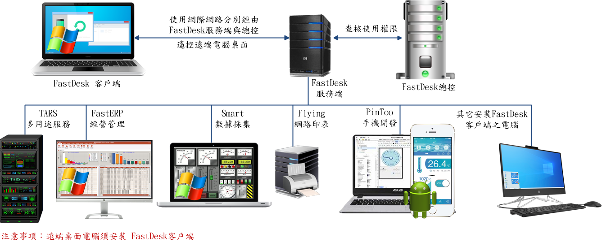
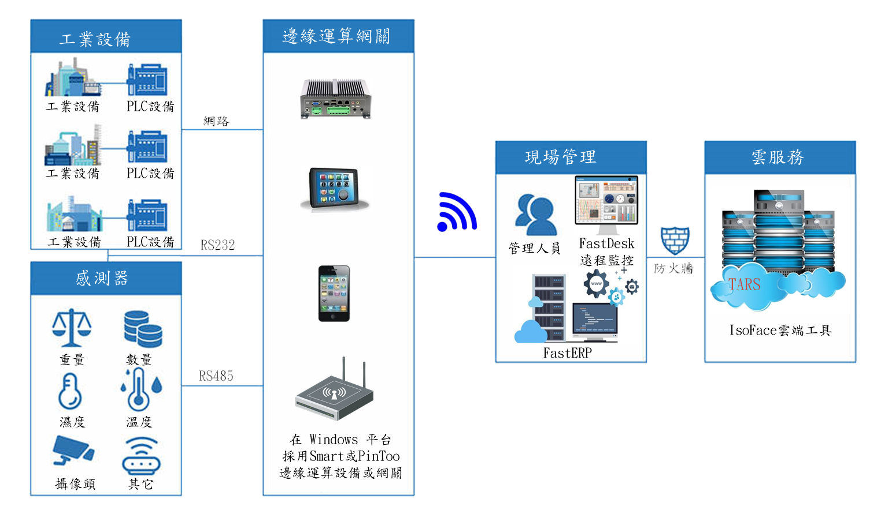

# FastDesk
FastDesk遠端桌面控制系統可滿足智慧化管理的需求，除了設備的控制與管理外，還能延伸到整合物聯網的應用，進而擴展到企業智慧化管理。其具備有遠端控制、分層授權管理、工作日誌管理，可與智慧物聯網(AIOT)、企業資源管理系統(ERP)等強大功能整合。發揮管理最大效能。運行版僅供個人且非商業使用。

> **加入 Facebook 社團**
>
> [https://www.facebook.com/groups/isoface/](https://www.facebook.com/groups/isoface/)
> 
> **點讚追蹤 Facebook 粉絲專頁**
> 
> [https://www.facebook.com/AIOT.ERP](https://www.facebook.com/AIOT.ERP)

## FastDesk遠端桌面控制系統－智慧管理、一步到位

FastDesk 應用架構在上圖中，劃分爲三部分

* **總控**：用於所有服務端，使用者端的許可權檢測，資源配置以及升級更新。

* **服務端**：為使用者端提供升級，遠端中轉服務，它的頻寬是遠端的核心。

* **使用者端**：可發起或接收遠端控制等功能。

總控可連線多個服務端，作為區分網域應用與負載均衡的用途。整體架構使用者端連線數無任何限制，完全由硬體配備、服務端數量與頻寬決定。它們可安裝在同一臺電腦，也能安裝在不同電腦。

FastDesk 是針對網路電腦裝置控制與管理而設計開發的系統平臺。管理單位可以很輕鬆地管理在企業各部門中的電腦裝置。 所有數據可以透過網路進行傳輸，同時也具備了物聯網 (IOT) 基礎架構，在未來具有符合趨勢的擴充性。

## 簡介

FastDesk 使用 Windows 電腦允許遙控桌面連線。提供發佈應用程式、負載平衡和連線等功能。遠端連線能在需要時隨時隨地存取數據和 Windows 應用程式。

* 支援 Windows 11/10/7/XP 和 Server 2016/2012/2008/2003 伺服器
* 使用標準遠端桌面連線協定 (RDP) 進行連線，使用者端連線裝置相容性高。
* 使用者端採用有線/無線網路連線，授權使用者端，可管理遙控多臺電腦，並可進行語音交談。
* 運用代理服務功能，企業內部不能上外網的電腦也能遠端遙控。
* 總控端負責許可權檢測及伺服器資源的分配，執行更有效率。
* 數據資料全部儲存在主機，比存放在各個電腦更加安全。
* 提供社區版使用，不限制使用者同時連線
* FastDesk 客戶端是綠色程式，可內建到第三方軟體中，更加方便一鍵呼叫。

## 特色

* 支援多個遠端桌面同時連線，與聲音重新導向，可雙向進行語音交談。
* 遠端桌面畫質支援最高 32 位元高彩色。可透過剪貼簿進行復制和貼上，發送訊息或文件。
* 使用者許可權管理支援最大 128 位元加密能力，以確保使用者端和伺服器之間的通訊安全
* 管理中心具備簡單易用的全功能設定，提供使用者遠端連線紀錄與工作日誌管理。
* 可搭配IsoFace軟體 Flying 進行遠端列印。
* 支援代理伺服器，讓內部網路也能運用遠端桌面功能。
* 系統自動更新功能，維持系統軟體在最新的狀態。
* 多遠端伺服器互相支援，平衡負載。具備總控系統，管理所有的遠端伺服器。
* 可與智慧物聯網(AIOT)與企業資源管理系統(ERP)整合執行
* 配合IsoFace軟件開發工具，設計監控管理系統、支援執行Smart、PinToo等邊緣運算裝置。

## 運用

使用FastDesk就像坐在電腦前一樣，可以在世界任何地方利用網路控制電腦。從另一臺電腦遠端存取桌面時，可充分利用桌面的功能。您將能夠：

* 即時檢視遠端電腦的螢幕，具有高清質量和高達40K的流，每秒40幀，低延遲。
* 從另一臺裝置遠端控制其它電腦，就像您親自使用它一樣。
* 打開和編輯儲存在遠端電腦上的任何文件，無需將文件上傳到云或通過電子郵件發送。
* 在遠端電腦上執行任何軟體應用程式。

**企業遠端桌面–啟用遠端工作**

FastDesk提供多種安全功能，將工作電腦帶到遠地辦公室，不用將數據發送到雲端也無須其它裝置或軟體，就能夠遠端進入工作電腦，存取文件，執行應用程式。

**遠端教學桌面–加強遠端學習**

實施遠端學習以遠端存取資源，在遠端使用自己的電腦裝置。學習各類應用程式。  FastDesk 遠端桌面工具超值、安全、高效能。隨時隨地想要工作？需要存取其他授權在 PC 上的應用程式？全交給 FastDesk！它可隨時隨地存取電腦，無論身在何處，存取桌面及其上的所有資源。只需要一個網際網路連線和FastDesk帳戶即可。

**工業智動化–遠端遙控邊緣運算裝置連線物聯網端點**

企業智慧物聯網 (AIoT)連線裝置，大幅革新企業工作方式；而其中物聯網端點(作業機臺或感測器)數量與邊緣運算裝置不斷成長。其高成本、通訊協定多元化，以及連線能力等問題，拖慢了企業物聯網專案的使用程序，FastDesk 遙控邊緣運算裝置連線物聯網端點。協助企業透過單一主控臺，安全管理任何裝置。無論探索工作區物聯網、試行測試，或準備推動生產環境，都可運用 FastDesk 搭配 IsoFace物聯網工具，確保所有端點皆受到管理，且符合企業安全性標準。

工業智動化基本架構是企業智慧物聯網的延伸，它架設遠端監控平臺，將廠區內所有作業機臺(物聯網端點)聯網上云，將所有生產製造範圍內的機具裝置、嵌入式裝置與控制系統整合在一起，進行遠端智慧化的管理，以實現一個最佳、最具競爭力的智慧製造環境。管理者藉由透過監控儀表板可完全掌控現場系統運作，達到降低潛在風險和減少管理成本開銷；再做數據資料蒐集、彙整、儲存與分析應用，提取有用訊息，以做精準預測或評估其有效性，以大幅提升企業生產力、效率。

* **FastDesk 簡介**：https://isoface.net/isoface/production/tool/fastdesk
* **FastDesk 幫助手冊**：https://isoface.net/isoface/doc/fastdesk/main/
* **FastDesk 快速上手**：https://isoface.net/isoface/teaching/fastdesk/1/
